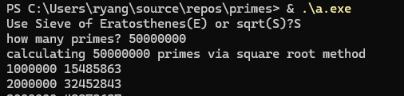
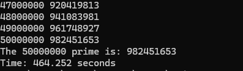
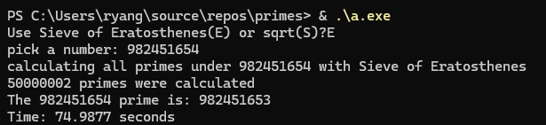

Simple Prime Calculating program. Calculated the first 50 Million primes in about 7-8 minutes.
Added Sieve of Eratosthenes, 50 millionth prime takes about 1-1.5 minutes.
Screenshots of each method:

Naive

Sieve of Eratosthenes

